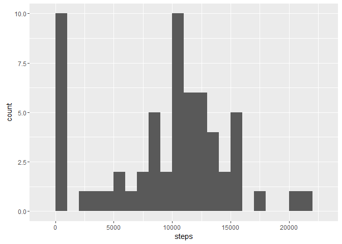
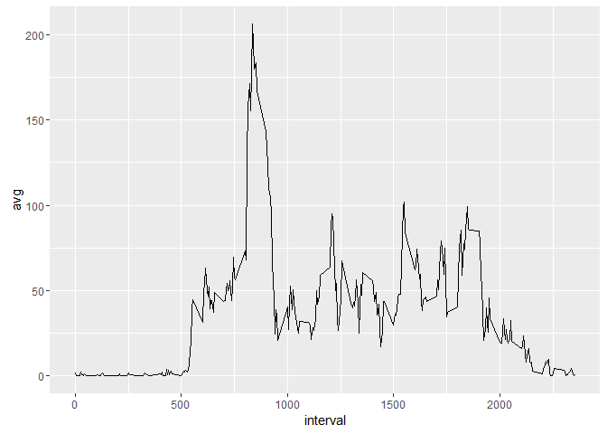
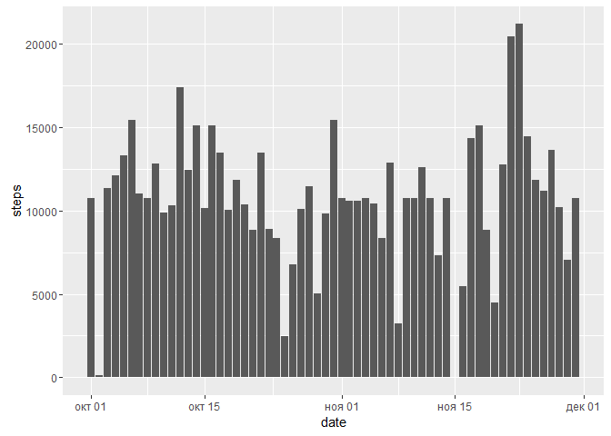
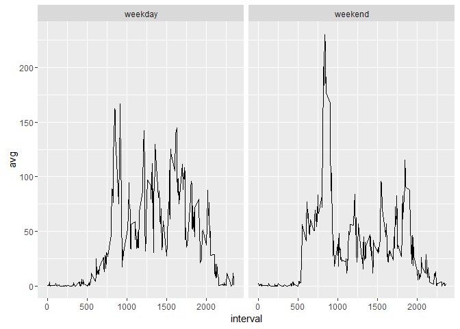

# Reproducible Research: Peer Assessment 1


## Loading and preprocessing the data

```r
data <- read.csv(unz("activity.zip","activity.csv"))
data$date <- as.Date(data$date)
```
## What is mean total number of steps taken per day?

```r
st <- group_by(data,date) %>%  
        summarise(steps = sum(steps, na.rm = T))  
ggplot(data = st, aes(x=date,y=steps)) + geom_bar(stat = "identity")
```



```r
mean(st$steps)
```

```
## [1] 9354.23
```

```r
median(st$steps)
```

```
## [1] 10395
```

## What is the average daily activity pattern?

```r
data2 <- filter(data, !is.na(steps)) %>% group_by(interval) %>% summarize(avg = mean(steps))
ggplot(data2, aes(x = interval, y = avg)) + geom_line()
```



```r
data2$interval[data2$avg == max(data2$avg)]
```

```
## [1] 835
```
## Imputing missing values

```r
sum(is.na(data$steps))
```

```
## [1] 2304
```

```r
data3 <- merge(data,data2,by="interval",all.x = T)
data3$steps[is.na(data3$steps)] <- data3$avg[is.na(data3$steps)]
data3 <-select(data3,steps,date,interval)
st <- group_by(data3,date) %>%  
        summarise(steps = sum(steps, na.rm = T))  
ggplot(data = st, aes(x=date,y=steps)) + geom_bar(stat = "identity")
```



```r
mean(st$steps)
```

```
## [1] 10766.19
```

```r
median(st$steps)
```

```
## [1] 10766.19
```
## Are there differences in activity patterns between weekdays and weekends?

```r
data3$dayfactor <- sapply(as.POSIXlt(data3$date)$wday,function(x) { if (x == 0 | x == 6) "weekday" else "weekend"})
group_by(data3, interval, dayfactor) %>% summarize(avg = mean(steps)) %>%
ggplot(aes(x=interval,y=avg)) + geom_line() + facet_wrap(~dayfactor)
```




